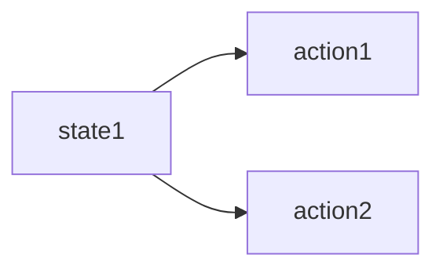
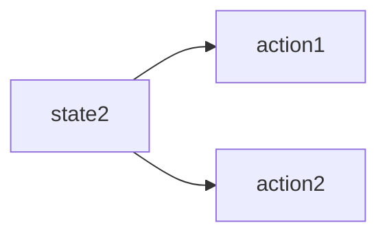

## Reinforcement Learning

### overview

- policy——exploration&exploitation

  ```mermaid
  graph LR
  	a[agent learner]--"action"-->b[environment]
  	b[environment]--"state"-->a[agent learner]
  	b[environment]--reward-->a[agent learner]
  ```

- solutions

  - 分类1
    - 不理解环境 Model-Free RL 无需对世界建模，只能对现实世界采取行动，所见即所得
      - Q learning
      - Sarsa
      - Policy Gradients
    - 理解环境 Model-Based RL 需要对世界建模，可以在虚拟世界中根据预判选择最好的决策
      - Q learning
      - Sarsa
      - Policy Gradients
  - 分类2
    - 基于概率 Policy-Based RL
      - 根据感知环境选择概率最高的方案
      - 每种方案都可能被选择，只是可能性不同
      - 离散和连续动作都适用
      - Policy Gradients
    - 基于价值 Value-Based RL
      - 根据感知环境选择价值最高的方案
      - 只选择价值最高的方案，判断标准很强硬
      - 只适用于离散动作
      - Q learning
      - Sarsa
    - 将基于价值和概率的方法结合 Actor-Critic
      - actor基于概率做出动作
      - critic给动作打分进行择优
  - 分类3
    - 回合更新 Monte-Carlo update
      - 在每一阶段结束后才更新状态
      - 基础版Policy Gradients
      - Monte-Carlo Learning
    - 单步更新 Temporal-Difference update
      - 在每一阶段中的每一步后都更新状态，边进行边学习
      - Q Learning
      - Sarsa
      - 升级版Policy Gradients
  - 分类4
    - 在线学习 On-Policy
      - 只能从自身行为学习
      - Sarsa
      - Sarsa($\lambda$)
    - 离线学习 Off-Policy
      - 可以通过观察其他个体行为或者自己行为来学习
      - Q Learning
      - Deep Q Network

### Q Learning —— Off-policy(离线学习型) —— 激进型

初始状态s1时，有两种行动方案可以选择



Q表：

|      |  a1  |  a2  |
| :--: | :--: | :--: |
|  s1  |  -2  |  1   |

因为a2值更高，所以选择a2作为本次行动方案，此时进入新的状态s2



Q表：

|      |  a1  |  a2  |
| :--: | :--: | :--: |
|  s2  |  -4  |  2   |

因为a2值更高，所以选择a2作为本次行动方案，此时进入新的状态s3,往复循环

Q表值更新的过程为：

- 先判断Q表中哪个行动的值最大，然后乘以一个衰减值$\gamma$ ，并加上到达s2时获得的奖励R

  $Q(s1,a2)现实=R+\gamma*maxQ(S2)$

  $Q(s1,a2)估计=Q(s1,a2)$

  差距=现实-估计

  $新Q(s1,a2)=老Q(s1,a2)+\alpha*差距$

- 伪代码

  Initialize $Q(s,a)$ arbitrarily
  Repeat (for each episode):
  	Initialize $s$
  	Repeat (for each step of episode):
  		choose $a$ from $s$ using policy derived from $Q$(e.g.,$\varepsilon$-greedy)
  		Take action $a$,observe $r,s'$
  		$Q(s,a)\leftarrow Q(s,a)+\alpha[r+\gamma max_{a'}Q(s',a')-Q(s,a)]$
  		$s\leftarrow s'$;
  until $s$ is terminal
  
  - 注释
    - $r+γmax_{a'}Q(s',a')$ —— Q(s1,a2)现实
    - $Q(s',a')$ —— Q(s2)最大估计
    - $Q(s,a)$ —— Q(s1,s2)估计
    - $\varepsilon$-greedy是决策概率，例如$\varepsilon$-greedy=0.9则我们会按照90%概率按照Q表的最优值选择行为，另外10%随机选择行为
    - **异策略指的是行动策略和评估策略不是一个策略，行动策略为$\varepsilon$-greedy，而更新Q表的评估策略是贪婪策略**
    - $\alpha$表示学习率，决定这次误差有多少要被学习，$\alpha<1$
    - $\gamma$是对未来奖励的衰减值
      - $Q(s1)=r2+\gamma Q(s2)=r2+\gamma [r3+\gamma Q(s3)]=...=r2+\gamma r3+\gamma^2r4+\gamma^3r5+...$
      - 可以看出Q表中的s1值与往后的所有奖励都有关，但是影响都是不断衰减的
      - $\gamma=0$时agent只能看到眼前的奖励$Q(s1)=r2$，看不到后期的奖励
      - $\gamma=1$时agent能看到后期所有的奖励$Q(s1)=r2+r3+r4+...$
      - $\gamma\in(0,1)$时agent能够逐渐看到后期所有的奖励，会变得有远见，为自己未来的利益着想

##### 例子

Q-learning 是一种记录行为值 (Q value) 的方法, 每种在一定状态的行为都会有一个值 `Q(s, a)`, 就是说 行为 `a` 在 `s` 状态的值是 `Q(s, a)`. `s` 在上面的探索者游戏中, 就是 `o` 所在的地点了. 而每一个地点探索者都能做出两个行为 `left/right`, 这就是探索者的所有可行的 `a` 啦.

如果在某个地点 `s1`, 探索者计算了他能有的两个行为, `a1/a2=left/right`, 计算结果是 `Q(s1, a1) > Q(s1, a2)`, 那么探索者就会选择 `left` 这个行为. 这就是 Q learning 的行为选择简单规则.

```python
import numpy as np
import pandas as pd
import time

from pandas import DataFrame


N_STATES = 6  # the length of the 1 dimensional world
ACTIONS = ['left', 'right']  # available actions
EPSILION = 0.9  # greedy police 贪婪程度
ALPHA = 0.1  # learning rate
LAMBDA = 0.9  # discount factor 奖励递减值
MAX_EPISODES = 13  # maximum episodes 最大游戏回合数
FRESH_TIME = 0.01  # fresh time for one move


def build_q_table(n_states, actions):
    table = pd.DataFrame(
        np.zeros((n_states, len(actions))), # q_table 全 0 初始
        columns=actions,  # actions' name
    )
    return table


def choose_action(state, q_table):
    # this is how to choose an action
    state_actions = q_table.iloc[state, :]
    if (np.random.uniform() > EPSILION) or (state_actions.all() == 0):
        action_name = np.random.choice(ACTIONS) # act randomly
    else: # act greedy
        action_name = state_actions.idxmax()
    return action_name


def get_env_feedback(S, A):
    # this is how agent will interact with the environment
    if A == 'right':  # move right
        if S == N_STATES - 2:   # terminate
            S_ = 'terminal'
            R = 1
        else:
            S_ = S + 1
            R = 0
    else:   # move left
        R = 0
        if S == 0:
            S_ = S  # reach the wall
        else:
            S_ = S - 1
    return S_, R


def update_env(S, episode, step_counter):
    # this is how environment be updated
    env_list = ['_']*(N_STATES-1) + ['T'] # ‘----------T’ our environment
    if S == 'terminal':
        interaction = 'Episode %s: total_steps = %s' % (episode+1, step_counter)
        print('\r{}'.format(interaction), end='')
        time.sleep(2)
        print('\r                          ', end='')
    else:
        env_list[S] = 'o'
        interaction = ''.join(env_list)
        print('\r{}'.format(interaction), end='')
        time.sleep(FRESH_TIME)


def rl():
    # main part of RL loop
    q_table = build_q_table(N_STATES, ACTIONS)   # create q table
    # 从第一个回合玩到最后一个回合
    for episode in range(MAX_EPISODES):
        step_counter = 0
        S = 0
        is_terminated = False
        update_env(S, episode, step_counter)    # 更新环境
        while not is_terminated:    # 游戏没结束时
            A = choose_action(S, q_table)
            S_, R = get_env_feedback(S, A)  # take action & get next state and reward
            q_predict = q_table.loc[S, A]    # 估计值
            if S_ != 'terminal':
                q_target = R + LAMBDA * q_table.iloc[S_, :].max()    # next state is not terminal
            else:
                q_target = R    # next state is terminal
                is_terminated = True

            q_table.loc[S, A] += ALPHA*(q_target - q_predict)     # update
            S = S_  # move to next state

            update_env(S, episode, step_counter+1)
            step_counter += 1
    return q_table


if __name__ == "__main__":
    q_table = rl()
    print('\r\nQ-TABLE:\n')
    print(q_table)
    
    
--------------------------RUN---------------------------------------
Q-TABLE:

       left     right
0  0.000001  0.005655
1  0.000001  0.029346
2  0.000076  0.115616
3  0.002236  0.343331
4  0.000810  0.745813
5  0.000000  0.000000

right对应的值都比left高，反应了对奖励的反馈
```

### Sarsa(Sarsa(0)) —— On-policy(在线学习型) —— 保守型

- Sarsa——state-action-reward-state'-action'
  - 采用Q-table的方式存储动作值函数；而且决策部分和Q-Learning是一样的, 也是采用ε-greedy策略。不同的地方在于 Sarsa 的更新方式是不一样的。

    1. sarsa是on-policy的更新方式，行动策略和评估策略都是ε-greedy策略
    2. Sarsa是先做出动作后更新

  - ​      **Q-Learning算法，先假设下一步选取最大奖赏的动作，更新值函数。然后再通过ε-greedy策略选择动作。**

    ​      **Sarsa算法，先通过ε-greedy策略执行动作，然后根据所执行的动作，更新值函数。**

和Q learning的不同在于更新方式，Q learning在做出下一步决策前会估算一下哪个行为会带来最大奖励，但是却不一定会选择这个对应最大奖励的行为，Sarsa则不同，他说到做到，此时的估计值也是他接下来要做的行为，因此也称Sarsa为在线学习型，他所学习的是他自己的行为

On-policy方法在一定程度上解决了exploring starts这个假设，让策略既greedy又exploratory，最后得到的策略也一定程度上达到最优。Off-policy方法就更加直接了，分别在策略估计和策略提升的时候使用两种策略，一个具有探索性的策略专门用于产生episode积累经验，称为behavior policy，另一个则是更具贪婪性，用来学习成为最优策略的target policy。

Q表值更新的过程为：

- 先判断Q表中哪个行动的值最大，然后乘以一个衰减值$\gamma$ ，并加上到达s2时获得的奖励R

  $Q(s1,a2)现实=R+\gamma*Q(S2)$

  $Q(s1,a2)估计=Q(s1,a2)$

  差距=现实-估计

  $新Q(s1,a2)=老Q(s1,a2)+\alpha*差距$

- 伪代码

  Initialize $Q(s,a)$ arbitrarily
  Repeat (for each episode):
  	Initialize $s$
  	Repeat (for each step of episode):

  ​		Take action $a$,observe $r,s'$

  ​		choose $a'$ from $s'$ using policy derived from $Q$(e.g.,$\varepsilon$-greedy)

  ​		$Q(s,a)\leftarrow Q(s,a)+\alpha[r+\gamma Q(s',a')-Q(s,a)]$
  ​		$s\leftarrow s'$;$a\leftarrow a'$
  until $s$ is terminal

  - 注释
    - $r+γQ(s',a')$ —— Q(s1,a2)现实
    - $Q(s',a')$ —— Q(s2)最大估计
    - $Q(s,a)$ —— Q(s1,s2)估计
    - $\varepsilon$-greedy是决策概率，例如$\varepsilon$-greedy=0.9则我们会按照90%概率按照Q表的最优值选择行为，另外10%随机选择行为
    - $\alpha$表示学习率，决定这次误差有多少要被学习，$\alpha<1$
    - $\gamma$是对未来奖励的衰减值
      - $Q(s1)=r2+\gamma Q(s2)=r2+\gamma [r3+\gamma Q(s3)]=...=r2+\gamma r3+\gamma^2r4+\gamma^3r5+...$
      - 可以看出Q表中的s1值与往后的所有奖励都有关，但是影响都是不断衰减的
      - $\gamma=0$时agent只能看到眼前的奖励$Q(s1)=r2$，看不到后期的奖励
      - $\gamma=1$时agent能看到后期所有的奖励$Q(s1)=r2+r3+r4+...$
      - $\gamma\in(0,1)$时agent能够逐渐看到后期所有的奖励，会变得有远见，为自己未来的利益着想

### Sarsa($\lambda$)

- Sarsa(0) 经典Sarsa算法—— 单步更新

  - 走完一步直接更新行为准则

- Sarsa(n) ——  回合更新

  - 一回合有n步，走完n步才更新

- Sarsa($\lambda $)

  - 为了统一这样的流程，我们引入一个$\lambda $来代替想要选择的步数 

  - Sarsa和Qlearning都是每次获取到奖励reward后只更新获取到reward的前一步，那么Sarsa($\lambda $)就是更新获取到reward的前$\lambda $步，$\lambda \in[0,1]$

  - Sarsa(0)只更新获取reward前经历的最后一步，Sarsa(1)更新的是获取到reward前所有经历的步，对所有步更新力度都是一样

    

- 伪代码

  Initialize $Q(s,a)$ arbitrarily,for all $s\in \mathcal{S},a \in\mathcal{A}(s)$
  Repeat (for each episode):

  ​	$E(s,a)=0$,for all $s\in \mathcal{S},a\in\mathcal{A}(s)$

  ​	Initialize $S,A$
  ​	Repeat (for each step of episode):

  ​		Take action $A$,observe $R,S'$

  ​		choose $A'$ from $S'$ using policy derived from $Q$(e.g.,$\varepsilon$-greedy)

  ​		$\delta \longleftarrow R+\gamma Q(S',A')-Q(S,A)$

  ​		$E(S,A)\leftarrow E(S,A)+1$

  ​		For all $s\in \mathcal{S},a \in \mathcal{A}(s):$

  ​			$Q(s,a)\leftarrow Q(s,a)+\alpha\delta E(s,a) $

  ​			$E(s,a)\leftarrow \gamma \lambda E(s,a)$

  ​			$S\leftarrow S'$;$A\leftarrow A'$
  until $S$ is terminal

- Sarsa($\lambda $)算法比Sarsa 算法中多了一个矩阵E (eligibility trace)，它用来保存在路径中所经历的每一步，并其值会不断地衰减。该矩阵的所有元素在每个回合的开始会初始化为 0，如果状态 s 和动作 a 对应的 E(s,a) 值被访问过，则会其值加一。并且矩阵 E 中所有元素的值在每步后都会进行衰减，这保证了离获得当前奖励越近的步骤越重要，并且如果前期智能体在原地打转时，经过多次衰减后其 E 值就接近于 0 了，对应的 Q 值几乎没有更新。

  值得注意的是，在更新 Q(s,a) 和 E(s,a) 时，是对“整个表”做更新，但是因为矩阵 E 的初始值是 0，只有智能体走过的位置才有值，所以并不是真正的对“整个表”做更新，而是更新获得奖励值之前经过的所有步骤。而那些没有经过的步骤因为对应的 E(s,a) 值为0，所以	$Q(s,a)\leftarrow Q(s,a)+\alpha\delta E(s,a) $，会保持原值不变。

- 矩阵E的两种更新方式

  1. accumulating trace

     每次走到当前状态，则当前状态矩阵E的元素值+1,即：

     $E(S,A)\leftarrow E(S,A)+1$

  2. replacing trace

     给矩阵E的元素值设置上限，使得其所有值在[0,1]之间，所以每次更新时先将当前状态所在的行清零，再对对应的E(s,a)置一

     $E(s,:) = 0,E(s,a) = 1$

  


### DQN —— Deep Q Network

我们在之前的方法中使用表格来存储每一个状态 state, 和在这个 state 每个行为 action 所拥有的 Q 值. 而当今问题是在太复杂,  如果全用表格来存储它们, 恐怕我们的计算机有再大的内存都不够,  而且每次在这么大的表格中搜索对应的状态也是一件很耗时的事. 

不过, 在机器学习中, 有一种方法对这种事情很在行, 那就是神经网络.  我们可以将状态和动作当成神经网络的输入, 然后经过神经网络分析后得到动作的 Q 值, 这样我们就没必要在表格中记录 Q 值,  而是直接使用神经网络生成 Q 值. 

还有一种形式的是这样, 我们也能只输入状态值, 输出所有的动作值, 然后按照 Q learning 的原则, 直接选择拥有最大值的动作当做下一步要做的动作. 我们可以想象, 神经网络接受外部的信息, 相当于眼睛鼻子耳朵收集信息,  然后通过大脑加工输出每种动作的值, 最后通过强化学习的方式选择动作.


接下来我们基于第二种神经网络来分析, 我们知道, 神经网络是要被训练才能预测出准确的值. 那在强化学习中, 神经网络是如何被训练的呢? 首先,  我们需要 a1, a2 正确的Q值, 这个 Q 值我们就用之前在 Q learning 中的 Q 现实来代替. 同样我们还需要一个 Q 估计  来实现神经网络的更新. 所以神经网络的的参数就是老的 NN 参数 加学习率 alpha 乘以 Q 现实 和 Q 估计 的差距. 我们整理一下.


我们通过 NN 预测出Q(s2, a1) 和 Q(s2,a2) 的值, 这就是 Q 估计. 然后我们选取 Q  估计中最大值的动作来换取环境中的奖励 reward. 而 Q 现实中也包含从神经网络分析出来的两个 Q 估计值, 不过这个 Q  估计是针对于下一步在 s' 的估计. 最后再通过刚刚所说的算法更新神经网络中的参数. 但是这并不是 DQN 会玩电动的根本原因.  还有两大因素支撑着 DQN 使得它变得无比强大. 这两大因素就是 Experience replay 和 Fixed Q-targets.


简单来说, DQN 有一个记忆库用于学习之前的经历.  Q learning 是一种 off-policy  离线学习法, 它能学习当前经历着的, 也能学习过去经历过的, 甚至是学习别人的经历. 所以每次 DQN 更新的时候,  我们都可以随机抽取一些之前的经历进行学习. 

随机抽取这种做法打乱了经历之间的相关性, 也使得神经网络更新更有效率. Fixed  Q-targets 也是一种打乱相关性的机理, 如果使用 fixed Q-targets, 我们就会在 DQN  中使用到两个结构相同但参数不同的神经网络, 预测 Q 估计 的神经网络具备最新的参数, 而预测 Q 现实 的神经网络使用的参数则是很久以前的.  

- deep Q-learning with experience replay

  - 伪代码

    Initialize replay memory D to capacity N

    Initialize action-value function Q with random weights $\theta$

    Initialize target action-value function $\hat{Q}$ with weights $\theta^{-}=\theta$

    For episode = 1,M do

    ​	Initialize sequence $s_1={x_1}$ and preprocessed sequence $\phi_1=\phi(s_1)$

    ​	For t=1,T do

    ​		with probability $\varepsilon $ select a random action $a_t$

    ​		otherwise select $a_t=argmax_a Q(\phi(s_1),a;\theta)$

    ​		Execute action $a_t$ in emulator and observe reward $r_t$ and image $x_{t+1}$

    ​		Set $s_{t+1}=s_t,a_t,x_{t+1}$ and preprocess $\phi_{t+1}=\phi(s_{t+1})$

    ​		store transition $(\phi_t,a_t,r_t,\phi_{t+1})$ in D

    ​		sample random minibatch of transitions $(\phi_j,a_j,r_j,\phi_{j+1})$ from D

    ​		set $y_j = \begin{cases} r_j	&if\ episode\ terminates\ at\ step\ j+1\\r_j+\gamma max_{a'} \hat{Q}(\phi_{j+1},a';\theta^-)&otherwise\end{cases}$

    ​		perform a gradient descent step on $(y_j-Q(\phi_j,a_j;\theta))^2$ eith respect to the net work parameters $\theta $

    ​		Every C steps reset $\hat{Q}=Q$

    ​	End For

    End For

  - 注释

    - Q learning主框架加上以下装饰
      - 记忆库（用于重复学习）
      - 神经网络计算Q值
      - 暂时冻结q_target参数（切断相关性）

- 神经网络
  - `target_net` 用于预测 `q_target` 值, 他不会及时更新参数.

  - `eval_net` 用于预测 `q_eval`, 这个神经网络拥有最新的神经网络参数.

  - 不过这两个神经网络结构是完全一样的, 只是里面的参数不一样.

  - 网络结构

    

    

  - `target_net` 是 `eval_net` 的一个历史版本, 拥有 `eval_net` 很久之前的一组参数, 而且这组参数被固定一段时间, 然后再被 `eval_net` 的新参数所替换. 而 `eval_net` 是不断在被提升的, 所以是一个可以被训练的网络 `trainable=True`. 而 `target_net` 的 `trainable=False`.
